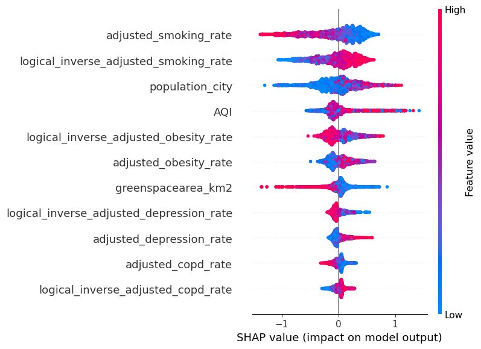

## Index 

1. [Introduction](#introduction)
2. [Data Collection](#data-collection)
3. [ML-Pipeline](#Machine-Learning-Pipeline)  
4. [Machine Learning Process Summary](#Machine-Learning-Process-Summary)  
5. [Model Performance](#model-performance)    
6. [Feature Importance](#feature-importance)  
7. [Conclusion](#conclusion)
8. [Credits and Management/Presentation Links](#Credits-and-Management/Presentation-Links)

---

## Introduction

**Welcome to the Environmental Factors on Public Health project.** 🌍

- This project aims to predict life expectancy based on various health metrics such as smoking status, obesity, air quality, and more. The model leverages advanced machine learning techniques to provide insights that can be used to improve public health strategies.

**Objective:**

- The primary objective of this project was to correlate the environmental factors to the public health metrics, and develop a robust machine learning model that could accurately predict life expectancy based on th

## Data Collection

### Source of Data
- **SimpleMaps**: Provided city data including coordinates and population. [SimpleMaps](https://simplemaps.com/data/world-cities)
- **Google Earth Engine (GEE)**: Used to obtain green space areas within city limits. [GEE](https://earthengine.google.com/)
- **Centers for Disease Control and Prevention (CDC)**: Collected health-related data such as obesity rates, smoking rates, exercise rates, and more.[CDC](https://cdi.cdc.gov/)
- **OpenWeather API**: Used to collect the Air Quality Index (AQI). [OpenWeatherAPI](https://openweathermap.org/api)

### Data Acquisition Process:

  1. **City Data**: Retrieved from SimpleMaps, focusing on cities in the US.
  2. **Green Spaces**: Data obtained via Google Earth Engine using city coordinates.
  3. **Health Metrics**: Retrieved from the CDC’s database, aggregated at the state level.
  4. **Air Quality Index (AQI)**: Collected via OpenWeather API for each city.

## Machine Learning Pipeline

*This diagram describes the entire Machine Learning process.*

### Data Cleaning
- **Handling Missing Values**: Imputed missing values where necessary.
- **Outlier Detection and Removal**: Identified and treated outliers in the dataset.
- **Converting Data Types**: Ensured all data types were appropriate for analysis.

### Feature Engineering
- **Creating New Features**: Developed features like logical inverse health metrics and adjusted health metrics at the city level.
- **Feature Selection**: Selected features based on correlation analysis to avoid multicollinearity.
- **Data Transformation**: Applied standardization and scaling to prepare the data for modeling.

### Exploratory Data Analysis (EDA)
- **Correlation Matrix**: Analyzed correlations between different features to understand relationships and dependencies.

## Machine Learning Process Summary

### Exploratory Data Analysis

- On this stage of the process, the data was organized at a city level, outliers were detected and solved. A correlation matrix was also done to detect relationships and how strong these were.

- After analyzing the variables relations we decided to drop highly correlated variables like **chronic diseases** and **exercise rate** to avoid multicollinearity.

### Models Used:

- **Linear Regression**
- **Decision Tree Regressor**
- **Random Forest Regressor**
- **Gradient Boosting Regressor**
- **Support Vector Regressor (SVR)**
- **XGBoost Regressor**

### Baseline Results:

### Hyperparameter Tuning
- **Cross-Validation**: Performed 5-fold cross-validation to validate model performance.

**GridSearchCV**: Used to find the best hyperparameters for Random Forest, XGBoost, and Decision Tree models.

- Random Forest = {'max_depth': None, 'max_features': None, 'min_samples_leaf': 1, 'min_samples_split': 2, 'n_estimators': 300}
- XGBoost = {'colsample_bytree': 0.9, 'learning_rate': 0.1, 'max_depth': 7, 'n_estimators': 300, 'subsample': 0.9}
- Decision Tree = {'max_depth': 40, 'max_features': None, 'min_samples_leaf': 1, 'min_samples_split': 10}

### Overfitting Check

- **Overfitting Mitigation**: Checked for overfitting by comparing performance on training and test data.

### Stacked Model

- **Meta-Model**: A Linear Regression model was used to stack the predictions of the best-performing models (Random Forest, XGBoost, Decision Tree).
- **Final Model Training**: The final stacked model was trained on the entire dataset.

## Model Performance

### Final Stacked Model Results
- **Training vs. Test Performance**: Comparison of performance metrics for the final stacked model on both training and test data.

## Feature Importance

### SHAP Analysis
- **SHAP Values**: Used to explain the impact of each feature on the model's predictions.

**Key Features**:
- Smoking Rate: Both adjusted_smoking_rate and its inverse are the most impactful features, indicating that smoking status is a major predictor of life expectancy or health outcomes.
- Population Size: population_city also shows significant influence, suggesting that urbanization or population-related factors play a crucial role in the model’s predictions.
- Obesity Rate: adjusted_obesity_rate and its inverse are also important, reflecting the well-known impact of obesity on health.

**Environmental Features**:
- AQI (Air Quality Index): Positioned in the middle of the SHAP summary plot, AQI has a moderate influence on the model’s predictions. This suggests that while air quality is not the most dominant factor, it still significantly contributes to the model’s decision-making process, aligning with real-world evidence that environmental factors affect health outcomes.

## Conclusion

### Summary

- **Model Performance:** The final stacked model exhibited strong performance, with high R² scores of 0.8413 on the training set and 0.8564 on the test set. The close alignment between these scores demonstrates that the model generalizes well, avoiding overfitting.
- **Error Metrics:** The Mean Absolute Error (MAE) and Mean Squared Error (MSE) were slightly lower on the test set compared to the training set, indicating the model’s robustness and reliability in predicting unseen data.
- **Exploratory Analysis:** While we did not conclusively prove a direct relationship between green spaces and the target variable, the analytical process allowed us to fine-tune our models and set the stage for more refined future research.

### Impact
- The potential impact of this project extends beyond the technical achievements. By exploring the relationship between environmental factors like green spaces and public health outcomes, this work contributes to the broader conversation about the importance of urban planning and public health policies.

## Credits and Management/Presentation Links

- **Author:** [Alexandre Ribeiro](https://www.linkedin.com/in/alexandre-ribeiro-264445279/)
- **Notion:** [Management - Notion](https://alpine-bathtub-2e4.notion.site/Environmental-factors-on-Public-Health-deea5e9c20714696972fc24a07de5fcc)
- **Streamlit:** [Streamlit](https://environmentalfactorsonpublichealth-mhqzqkmqrhuhqqyt8h9yci.streamlit.app/)
