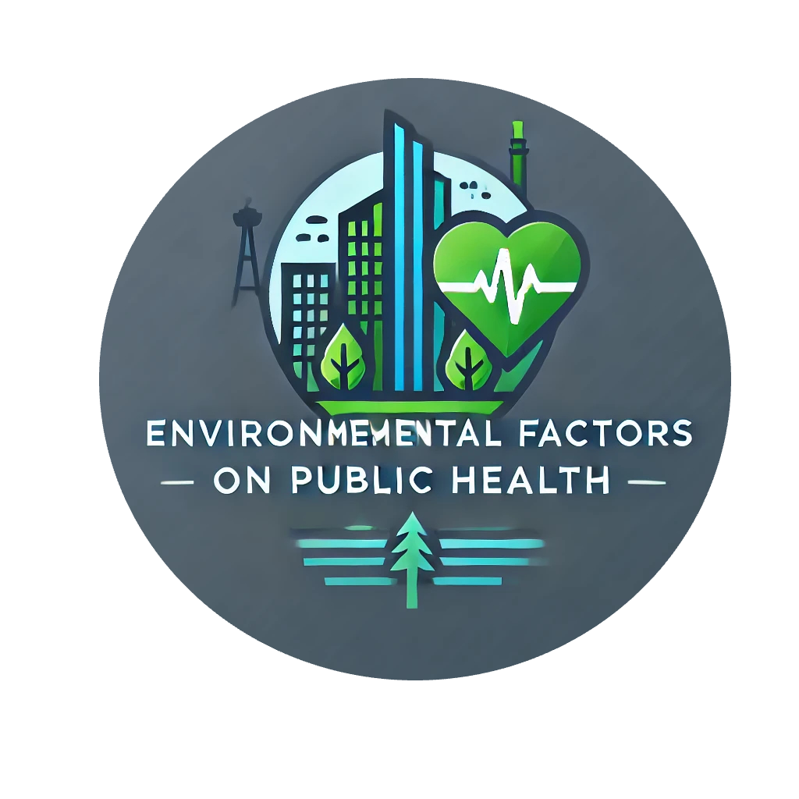

## Index 

1. [Introduction](#introduction)
2. [Objective](#objective)
3. [Data Collection](#data-collection)
4. [ML-Pipeline](#Machine-Learning-Pipeline)  
5. [Machine Learning Process Summary](#Machine-Learning-Process-Summary)  
6. [Model Performance](#model-performance)    
7. [Feature Importance](#feature-importance)
8. [Deployment](#deployment)  
9. [Challenges and Future Work](#challenges-and-future-work) 
10. [Conclusion](#conclusion)
11. [Credits and Management/Presentation Links](#Credits-and-Management/Presentation-Links)

---

## Introduction

**Welcome to the Environmental Factors on Public Health project.** 🌍

- This project aims to predict life expectancy based on various health metrics such as smoking status, obesity, air quality, and more. The model leverages advanced machine learning techniques to provide insights that can be used to improve public health strategies.

**Objective:**

- The primary objective of this project was to correlate the environmental factors to the public health metrics, and develop a robust machine learning model that could accurately predict life expectancy based on th

## Data Collection

### Source of Data
- **SimpleMaps**: Provided city data including coordinates and population. [SimpleMaps](https://simplemaps.com/data/world-cities)
- **Google Earth Engine (GEE)**: Used to obtain green space areas within city limits. [GEE](https://earthengine.google.com/)
- **Centers for Disease Control and Prevention (CDC)**: Collected health-related data such as obesity rates, smoking rates, exercise rates, and more.[CDC](https://cdi.cdc.gov/)
- **OpenWeather API**: Used to collect the Air Quality Index (AQI). [OpenWeatherAPI](https://openweathermap.org/api)

### Data Acquisition Process:

  1. **City Data**: Retrieved from SimpleMaps, focusing on cities in the US.
  2. **Green Spaces**: Data obtained via Google Earth Engine using city coordinates.
  3. **Health Metrics**: Retrieved from the CDC’s database, aggregated at the state level.
  4. **Air Quality Index (AQI)**: Collected via OpenWeather API for each city.

## Machine Learning Pipeline

*This diagram describes the entire Machine Learning process.*

### Data Cleaning
- **Handling Missing Values**: Imputed missing values where necessary.
- **Outlier Detection and Removal**: Identified and treated outliers in the dataset.
- **Converting Data Types**: Ensured all data types were appropriate for analysis.

### Feature Engineering
- **Creating New Features**: Developed features like logical inverse health metrics and adjusted health metrics at the city level.
- **Feature Selection**: Selected features based on correlation analysis to avoid multicollinearity.
- **Data Transformation**: Applied standardization and scaling to prepare the data for modeling.

### Exploratory Data Analysis (EDA)
- **Correlation Matrix**: Analyzed correlations between different features to understand relationships and dependencies.

## Machine Learning Process Summary

### Exploratory Data Analysis

- On this stage of the process, the data was organized at a city level, outliers were detected and solved. A correlation matrix was also done to detect relationships and how strong these were.

- After analyzing the variables relations we decided to drop highly correlated variables like **chronic diseases** and **exercise rate** to avoid multicollinearity.

### Models Used:

- **Linear Regression**
- **Decision Tree Regressor**
- **Random Forest Regressor**
- **Gradient Boosting Regressor**
- **Support Vector Regressor (SVR)**
- **XGBoost Regressor**

### Baseline Results:

### Hyperparameter Tuning
- **GridSearchCV**: Used to find the best hyperparameters for Random Forest, XGBoost, and Decision Tree models.
- **Cross-Validation**: Performed 5-fold cross-validation to validate model performance.

### Overfitting Check
- **Overfitting Mitigation**: Checked for overfitting by comparing performance on training and test data.

### Stacked Model
- **Meta-Model**: A Linear Regression model was used to stack the predictions of the best-performing models (Random Forest, XGBoost, Decision Tree).
- **Final Model Training**: The final stacked model was trained on the entire dataset.

## Model Performance

### Performance Metrics
- **Evaluation Metrics**: The models were evaluated using Mean Absolute Error (MAE), Mean Squared Error (MSE), and R² score.
- **Comparison of Models**: Detailed comparison of model performance metrics.

### Final Stacked Model Results
- **Training vs. Test Performance**: Comparison of performance metrics for the final stacked model on both training and test data.

## Feature Importance

### SHAP Analysis
- **SHAP Values**: Used to explain the impact of each feature on the model's predictions.
- **Key Features**: Identified the most significant features affecting life expectancy predictions.

## Deployment

### Streamlit Application
- **Overview**: Developed an interactive web application using Streamlit where users can input their data to predict life expectancy.
- **User Instructions**: Detailed instructions on how to use the app, interpret the results, and receive health suggestions.

## Challenges and Future Work

### Challenges Faced
- **Data Limitations**: Discussed challenges such as missing data, computational constraints, and model complexity.
- **Overfitting**: Addressed the challenge of overfitting in model training.

### Future Enhancements
- **Improving Model Accuracy**: Suggestions for incorporating additional data sources and refining the model.
- **Wider Deployment**: Plans to deploy the model in different environments for broader use.

## Conclusion

### Summary
Summarized the key findings and achievements of the project.

### Impact
Reflected on the potential impact of the project on public health awareness and policy-making.

## Credits and Management/Presentation Links

**Author:** [Alexandre Ribeiro](https://www.linkedin.com/in/alexandre-ribeiro-264445279/)
**Notion:** [Management - Notion](https://alpine-bathtub-2e4.notion.site/Environmental-factors-on-Public-Health-deea5e9c20714696972fc24a07de5fcc)
**Streamlit:** [Streamlit]()
